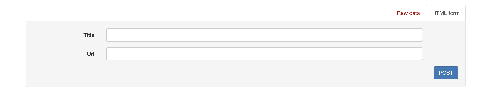

<h1 align="center">JULLIT</h1>

## Description
<p align="center">

Jullit is Reddit clone with API calls, in which you can create posts, vote for them, delete your vote and the post itself. Authentication is configured so that only the user who created topic or the admin can delete the post and vote.

<p align="center">





</p>

### About the project.
The project is completely done with Django and Django REST Framework. SQLite was used as a database.

## Project setup

```
On Mac
python3 manage.py runserver

Windows
python manage.py runserver
```